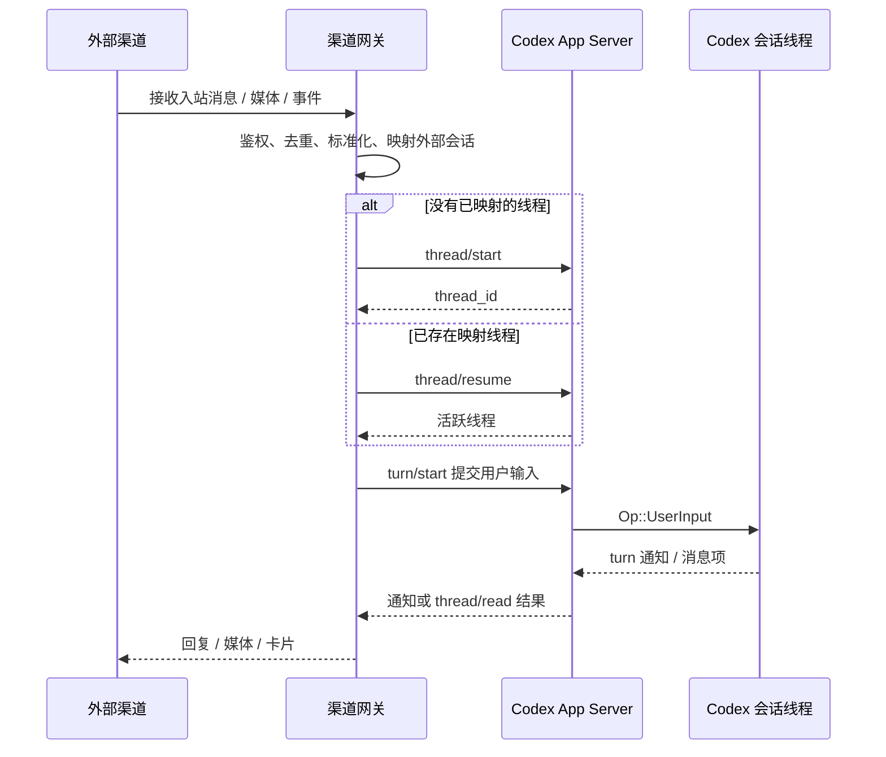

# Channel 到 Codex App Server 迁移调研

本文聚焦 OpenClaw/AstronClaw 的 channel 能力如何迁移到 Codex app-server。文档按固定模板组织，结论均基于当前仓库源码。

## 1. 模块定位

Channel 迁移模块负责把外部生态渠道的 inbound message/event 转成 Codex thread/turn 输入，并把 Codex 输出回写到外部渠道。

在 Codex 体系中，channel runtime 不在 plugin/hook 内执行，而应位于外部 gateway：

```text
WeCom/DingTalk/WeChat/Weibo/QQ Bot
  -> Channel Gateway
  -> Codex App Server JSON-RPC
  -> Codex Thread / Turn
  -> Channel Gateway
  -> External Channel
```

## 2. 源码范围

### 相关目录

| 目录 | 作用 |
| --- | --- |
| `codex-rs/app-server-protocol/src/protocol/` | app-server JSON-RPC 协议定义。 |
| `codex-rs/app-server-protocol/src/protocol/v2/` | v2 thread、turn、realtime 参数和通知结构。 |
| `codex-rs/app-server/src/request_processors/` | app-server 请求处理逻辑。 |
| `codex-rs/app-server/src/request_processors/thread_processor.rs` | thread 创建、恢复、读取、列表等处理。 |
| `codex-rs/app-server/src/request_processors/turn_processor.rs` | turn 启动、steer、interrupt、realtime append、inject items 处理。 |
| `codex-rs/app-server/src/request_processors/thread_lifecycle.rs` | thread listener、事件转发、订阅连接管理。 |

### 关键文件

| 文件 | 具体原因 |
| --- | --- |
| `codex-rs/app-server-protocol/src/protocol/common.rs` | JSON-RPC 方法清单，确认存在 `thread/start`、`thread/resume`、`turn/start`、`turn/steer`、`thread/realtime/*`。 |
| `codex-rs/app-server-protocol/src/protocol/v2/thread.rs` | `ThreadStartParams`、`ThreadResumeParams`、`ThreadReadParams`、`ThreadInjectItemsParams`。 |
| `codex-rs/app-server-protocol/src/protocol/v2/turn.rs` | `TurnStartParams`、`TurnSteerParams`、`UserInput`。 |
| `codex-rs/app-server-protocol/src/protocol/v2/realtime.rs` | realtime text/audio/speech API 参数。 |
| `codex-rs/app-server/src/request_processors/thread_processor.rs` | `thread/start`、`thread/resume` 实际处理。 |
| `codex-rs/app-server/src/request_processors/turn_processor.rs` | `turn/start` 最终提交 `Op::UserInput`，是 channel inbound 触发推理的核心。 |
| `codex-rs/app-server/src/request_processors/thread_lifecycle.rs` | thread event listener 与通知转发。 |

### 入口文件

| 入口 | 相关目录 | 说明 |
| --- | --- | --- |
| app-server JSON-RPC | `app-server-protocol/src/protocol/common.rs` | 外部 gateway 调用 Codex 的协议入口。 |
| `thread/start` | `v2/thread.rs`, `thread_processor.rs` | 创建 Codex thread。 |
| `thread/resume` | `v2/thread.rs`, `thread_processor.rs` | 恢复已有 thread。 |
| `turn/start` | `v2/turn.rs`, `turn_processor.rs` | 提交用户消息并启动推理。 |
| `thread/read` / notifications | `v2/thread.rs`, `thread_lifecycle.rs` | 读取或接收 Codex 输出。 |

## 3. 核心职责

### 负责

- 把外部 channel 的用户消息映射为 `UserInput::Text`、`UserInput::Image` 或 `UserInput::LocalImage`。
- 维护外部会话和 Codex `thread_id` 的映射。
- 调用 `thread/start` 或 `thread/resume` 管理 Codex 会话。
- 调用 `turn/start` 触发 Codex 推理。
- 读取 Codex 输出并回写到外部渠道。
- 在 gateway 层处理账号、鉴权、去重、媒体、重试、回执。

### 不负责

- 不通过 Codex hook 直接接收外部消息。
- 不把 OpenClaw JS channel runtime 嵌入 Codex core。
- 不用 `thread/inject_items` 作为实时用户消息入口。
- 不把 channel secret 写进 skill 或 plugin manifest。
- 不在模型工具里做强制鉴权、计费或租户隔离。

## 4. 核心流程



源码依据：

- `codex-rs/app-server-protocol/src/protocol/common.rs`
- `codex-rs/app-server-protocol/src/protocol/v2/thread.rs`
- `codex-rs/app-server-protocol/src/protocol/v2/turn.rs`
- `codex-rs/app-server/src/request_processors/turn_processor.rs`

## 5. 关键实现

### 5.1 核心实现

#### Thread 生命周期

`common.rs` 暴露 thread 生命周期方法：

- `thread/start`
- `thread/resume`
- `thread/fork`
- `thread/archive`
- `thread/delete`
- `thread/read`
- `thread/list`
- `thread/turns/list`

`v2/thread.rs` 中 `ThreadStartParams` 支持模型、cwd、sandbox、permissions、developer instructions、dynamic tools、selected capability roots 等配置。

迁移判断：

- channel gateway 可以为不同渠道、租户或 bot 创建不同 thread。
- 外部 conversation id 应映射到 Codex `thread_id`。
- `thread/resume` 优先用 `thread_id`，必要时用 path/history。

#### Turn 输入

`common.rs` 暴露：

- `turn/start`
- `turn/steer`
- `turn/interrupt`

`v2/turn.rs` 中 `TurnStartParams` 包含：

- `thread_id`
- `client_user_message_id`
- `input: Vec<UserInput>`
- `responsesapi_client_metadata`
- `additional_context`
- turn 级 cwd、permission、model、service tier 等覆盖项

`UserInput` 支持：

- `Text`
- `Image`
- `LocalImage`
- `Skill`
- `Mention`

`turn_processor.rs` 的 `turn_start_inner` 将 `UserInput` 转成 core input，并提交：

```text
Op::UserInput
```

迁移判断：

- 普通 channel inbound message 应调用 `turn/start`。
- 外部 message id 应放入 `client_user_message_id`，用于幂等和追踪。
- channel metadata 可放入 `responsesapi_client_metadata` 或 gateway 自己的 DB。

#### 历史注入

`thread/inject_items` 只追加 raw Responses API items，不启动用户 turn。

源码依据：

- `v2/thread.rs` 的 `ThreadInjectItemsParams`
- `turn_processor.rs` 的 `thread_inject_items_response_inner`

迁移判断：

- 适合导入历史或补齐上下文。
- 不适合作为微信/微博/钉钉等实时消息入口。

#### Realtime

`common.rs` 和 `v2/realtime.rs` 暴露：

- `thread/realtime/start`
- `thread/realtime/appendText`
- `thread/realtime/appendAudio`
- `thread/realtime/appendSpeech`

迁移判断：

- 适合语音/实时交互探索。
- 当前协议标注 experimental，应灰度使用。
- 生产 channel 先用 `turn/start` 跑通。

### 5.2 关键模块

| 模块 | 关键实现 | 迁移价值 |
| --- | --- | --- |
| App Server Protocol | `common.rs`, `v2/thread.rs`, `v2/turn.rs` | 定义 gateway 能调用的 API。 |
| Thread Processor | `thread_processor.rs` | 创建/恢复/读取 thread。 |
| Turn Processor | `turn_processor.rs` | 把 channel 用户消息变成 Codex 推理。 |
| Thread Lifecycle | `thread_lifecycle.rs` | 事件通知、listener、订阅连接管理。 |
| Realtime Protocol | `v2/realtime.rs` | 语音/实时 channel 备选路径。 |

## 6. 对外接口

### 上游调用方

- 企业微信 gateway
- 钉钉 gateway
- 微信 gateway
- 微博 gateway
- QQ Bot gateway
- AstronClaw cloud/local bridge
- 自有 web/mobile UI

### 下游依赖

- Codex app-server JSON-RPC。
- Codex thread store / rollout history。
- Codex core inference runtime。
- Channel MCP tools，用于模型主动发消息、查联系人、上传媒体等。

### 主要的接口

| 接口 | 用途 | 迁移用法 |
| --- | --- | --- |
| `thread/start` | 创建新 thread | 新外部会话首次进入时调用。 |
| `thread/resume` | 恢复 thread | 已有外部会话再次发消息时调用。 |
| `turn/start` | 提交用户输入 | channel inbound 的主入口。 |
| `turn/steer` | steering 活跃 turn | 只在有 active turn 且知道 `expected_turn_id` 时使用。 |
| `thread/read` | 读取 thread | 补偿查询、重连恢复、离线读取。 |
| `thread/turns/list` | 分页读取 turns | gateway 需要重建状态时使用。 |
| `thread/inject_items` | 导入 raw history | 只做历史注入，不触发回复。 |
| `thread/realtime/*` | 实时文本/音频 | experimental，语音场景再评估。 |

## 7. 可观测性

### 当前已做的观测

- `turn/start` 支持 `client_user_message_id`，可关联外部 message id。
- `turn/start` 支持 `responsesapi_client_metadata`，可携带 channel/source metadata。
- app-server 有 turn/thread server notifications，例如 `turn/started`、`turn/completed`、`thread/started`。
- `thread/read` 和 `thread/turns/list` 可用于补偿读取。

源码依据：

- `codex-rs/app-server-protocol/src/protocol/v2/turn.rs`
- `codex-rs/app-server-protocol/src/protocol/common.rs`

### 未来可补齐

- Gateway 维度：channel、tenant、bot、external conversation id、external message id、Codex thread id、turn id。
- 消息状态：received、deduped、submitted、completed、failed、replied、acknowledged。
- 媒体状态：downloaded、normalized、uploaded、failed。
- 延迟指标：channel inbound 到 `turn/start`、turn duration、Codex output 到 channel reply。
- 错误维度：app-server error、channel API error、MCP tool error、rate limit、auth failure。
- 可观测性模块应只提供统一埋点接口和 schema，业务模块决定埋点位置。

## 8. 二开模块兼容性

### 8.1 AstronClaw 模块迁移

#### AstronClaw channel

推荐接入方式：

```text
AstronClaw channel
  -> AstronClaw gateway
  -> Codex app-server thread/turn
  -> Codex output
  -> AstronClaw gateway
```

微博、微信、飞书、钉钉、企业微信、QQ Bot 都按同一模式迁移。

可行性：高。

依赖项：

- gateway 服务。
- 外部账号/机器人认证。
- thread mapping DB。
- 消息幂等表。
- channel MCP tools。

#### 工具

channel 发送能力不应塞进 app-server protocol，而应作为 MCP tools：

- send message
- send media
- create card
- lookup contact/group
- upload file
- recall/update message

#### 端云协同

端云协同建议拆成：

- 云端 gateway：租户、设备、账号、消息路由。
- 本地 Codex app-server：thread/turn 执行。
- MCP server：外部业务动作。
- hooks：trace/artifact/策略。

#### Team

team 模式如果通过 channel 触发，gateway 只负责把消息送入 `turn/start`；team 编排本身应由 MCP 或 Codex native multi-agent extension 实现。

#### Skills

channel skills 应说明：

- channel 消息来源和上下文。
- 可用 MCP tools。
- 回复格式/限制。
- 媒体处理规则。
- 不要包含 secret。

### 8.2 如何二开

横向扩展一个新 channel：

1. 新建 gateway 服务。
2. 实现外部 channel webhook/callback。
3. 维护 external conversation -> Codex thread mapping。
4. 首次消息调用 `thread/start`。
5. 每条用户消息调用 `turn/start`。
6. 订阅通知或轮询 `thread/read`。
7. 将 Codex 输出转换为 channel 消息。
8. 将发送/查询类能力封装成 MCP tools。
9. 用 Codex plugin 打包 `skills + mcpServers + hooks + apps`。

### 8.3 改造难度评估

| 改造项 | 难度 | 原因 |
| --- | --- | --- |
| 普通文本 channel | 中 | app-server API 足够，主要难点在 gateway 和幂等。 |
| 图片/文件 channel | 中高 | 需要媒体下载、URL/本地路径、安全扫描、大小限制。 |
| 卡片/富文本 channel | 中高 | 需要 channel-specific renderer。 |
| 群聊/多用户会话 | 中高 | 需要 thread mapping、用户身份注入、权限隔离。 |
| 语音/实时 channel | 高 | realtime API experimental，音频管线复杂。 |
| 端云协同 channel | 高 | 涉及 relay、设备、租户、网络、鉴权。 |

## 9. 风险

| 风险 | 影响 | 缓解 |
| --- | --- | --- |
| 用 hook 承接 inbound channel | 外部消息没有可靠入口 | 使用 app-server `thread/start` + `turn/start`。 |
| 误用 `thread/inject_items` | 只写历史，不触发推理 | 实时消息统一走 `turn/start`。 |
| 未做消息幂等 | 重复回复、重复执行工具 | 用 external message id + thread id + turn id 去重。 |
| media 直接透传 | 安全和稳定风险 | gateway 做下载、扫描、大小限制、格式转换。 |
| realtime API 过早生产依赖 | API 变化导致 channel 不稳定 | 先普通 turn，realtime 灰度。 |
| channel secret 放入 plugin/skill | 泄漏风险 | secret 放 gateway env/secret manager。 |
| gateway 无补偿读取 | 丢通知后无法恢复 | 使用 `thread/read` / `thread/turns/list` 补偿。 |
| 将发送消息做成 app-server 内置 API | 污染 Codex core | 发送/查询类业务动作走 MCP。 |
