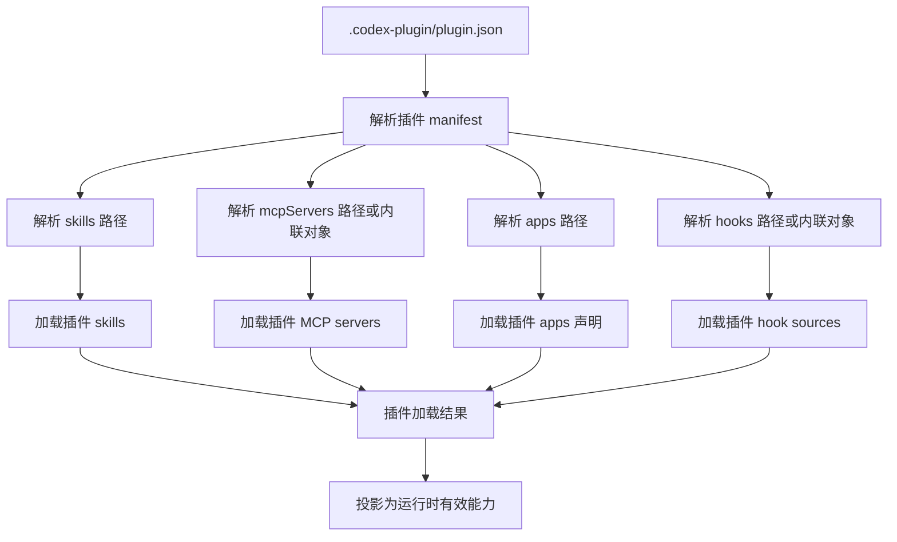
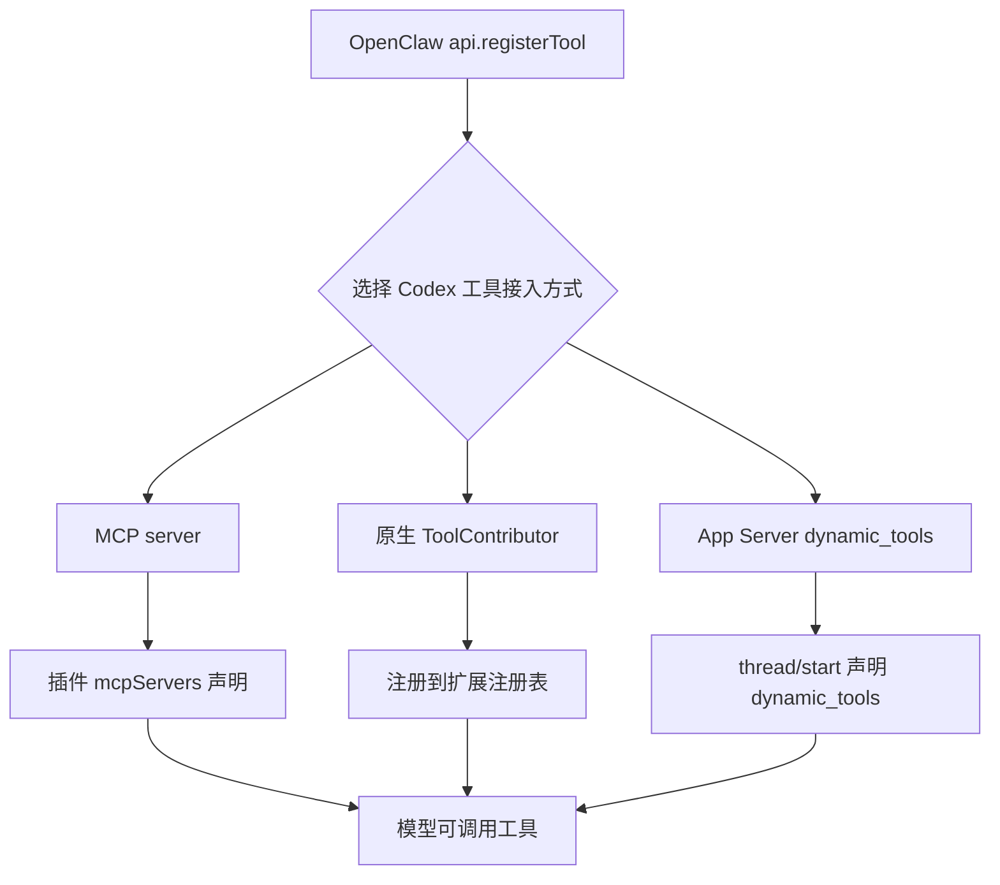
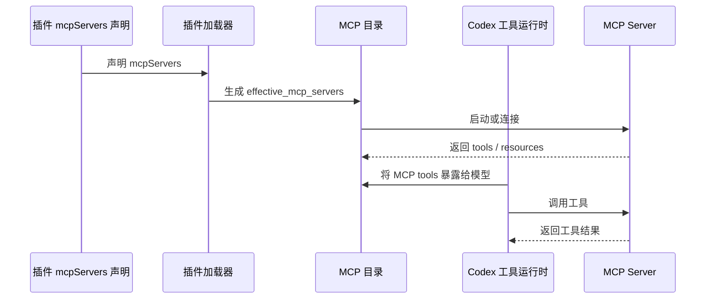
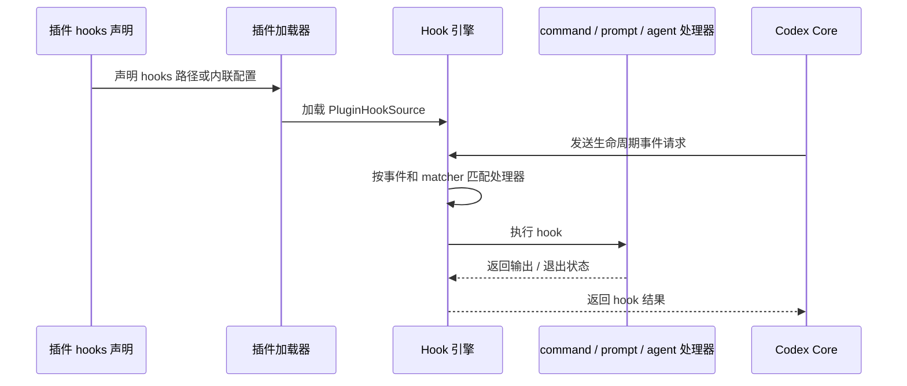

# Codex 插件、Hooks、MCP、Skills 扩展机制调研

本文聚焦除 channel->app-server 之外的 Codex 扩展能力：Plugin、Hooks、MCP、Skills、Apps connector 声明，以及 OpenClaw/AstronClaw 平台能力迁移可行性。文档按固定模板组织，结论均基于当前仓库源码。

## 1. 模块定位

这个模块负责 Codex 扩展能力的声明、加载、注入和运行时投影。

它承接 OpenClaw 的以下能力：

```text
OpenClaw plugin
  api.registerTool
  registerToolHooks
  skills
  configSchema
  contracts

Codex extension capabilities
  .codex-plugin/plugin.json
  mcpServers
  hooks
  skills
  apps
  interface
```

## 2. 源码范围

### 相关目录

| 目录 | 作用 |
| --- | --- |
| `codex-rs/plugin/src/` | plugin 共享模型、manifest 类型、加载结果、plugin id。 |
| `codex-rs/core-plugins/src/` | plugin manifest 解析、加载、manager、marketplace、apps/MCP routing。 |
| `codex-rs/hooks/src/` | hooks engine、events、declarations、discovery、output parsing。 |
| `codex-rs/config/src/` | hooks/MCP/skills/apps 配置结构。 |
| `codex-rs/codex-mcp/src/` | MCP catalog、connection manager、tools、apps MCP。 |
| `codex-rs/ext/mcp/src/` | hosted plugin runtime MCP 和 selected executor plugin MCP contributor。 |
| `codex-rs/core-skills/src/` | skill 模型、加载、注入相关基础能力。 |
| `codex-rs/skills/src/` | bundled/system skills 资产和 skills 服务。 |
| `codex-rs/ext/skills/src/` | skills extension、provider、render、selection、tools。 |

### 关键文件

| 文件 | 具体原因 |
| --- | --- |
| `codex-rs/core-plugins/src/manifest.rs` | 解析 plugin manifest，确定可声明字段。 |
| `codex-rs/core-plugins/src/loader.rs` | 加载 plugin skills、MCP、apps、hooks。 |
| `codex-rs/plugin/src/lib.rs` | 定义 `PluginCapabilitySummary`、`PluginHookSource`、`AppDeclaration`、`PluginTelemetryMetadata`。 |
| `codex-rs/plugin/src/load_outcome.rs` | 定义 `effective_mcp_servers`、`effective_apps`、`effective_plugin_hook_sources`。 |
| `codex-rs/config/src/hook_config.rs` | 定义 hook 事件与 handler 类型。 |
| `codex-rs/hooks/src/declarations.rs` | 将 plugin hook sources 转为 hook declarations。 |
| `codex-rs/hooks/src/events/pre_tool_use.rs` | 工具调用前 hook 的输入输出能力。 |
| `codex-rs/hooks/src/events/post_tool_use.rs` | 工具调用后 hook 的输入输出能力。 |
| `codex-rs/hooks/src/engine/mod.rs` | hook engine run/preview 入口。 |
| `codex-rs/config/src/mcp_types.rs` | MCP server 配置结构。 |
| `codex-rs/core/src/mcp.rs` | MCP runtime catalog 合并入口。 |
| `codex-rs/codex-mcp/src/mcp/mod.rs` | MCP server 名、apps MCP、hosted plugin runtime 相关常量/配置。 |
| `codex-rs/ext/mcp/src/lib.rs` | app-server 安装 MCP contributor。 |
| `codex-rs/ext/skills/src/extension.rs` | skills extension 安装和工具贡献。 |
| `codex-rs/ext/skills/src/provider.rs` | skills provider 查询来源。 |

### 入口文件

| 入口 | 相关目录 | 说明 |
| --- | --- | --- |
| `.codex-plugin/plugin.json` | plugin root | plugin 声明入口。 |
| `.mcp.json` | plugin root | MCP server 声明入口。 |
| `hooks/hooks.json` | plugin root | hook 声明入口。 |
| `skills/**/SKILL.md` | plugin/user/repo skills root | skill 声明入口。 |
| Codex config `mcp_servers` | config | 用户/项目 MCP 配置入口。 |
| Codex config `hooks` | config | 用户/项目/managed hooks 配置入口。 |

## 3. 核心职责

### 负责

- 解析 plugin manifest 并解析相对路径。
- 加载 plugin skills、MCP servers、apps declarations、hook sources。
- 根据 active/auth/config 状态投影 effective capabilities。
- 在指定生命周期事件运行 hooks。
- 把 MCP servers 暴露成模型可调用工具。
- 把 skills 摘要和选中 skill 指令注入模型上下文。
- 为 plugin/app/MCP/hook 提供基础可观测元数据。

### 不负责

- 不执行 OpenClaw JS plugin runtime。
- 不直接执行 `api.registerTool(...)`；工具能力应迁为 MCP、native extension tool 或 app-server dynamic tool。
- 不直接运行 OpenClaw `registerToolHooks(api)`；hook 需改成 Codex command/prompt/agent handler。
- 不负责 channel inbound runtime；channel 由 app-server gateway 文档覆盖。
- 不负责业务系统 secret 管理、租户鉴权、计费强制执行。

## 4. 核心流程

### 4.1 Plugin 能力加载流程



源码依据：

- `codex-rs/core-plugins/src/manifest.rs`
- `codex-rs/core-plugins/src/loader.rs`
- `codex-rs/plugin/src/load_outcome.rs`

### 4.2 工具能力接入流程

Codex 工具能力有三条主要接入路径：

- MCP server：外部进程/HTTP 服务提供工具。
- Native extension tool：Rust extension 实现 `ToolContributor`，直接贡献 `ToolExecutor`。
- Dynamic tools：app-server client 在线程启动时声明工具，模型调用后由 client 响应。



源码依据：

- `codex-rs/ext/extension-api/src/contributors.rs`
- `codex-rs/ext/extension-api/src/registry.rs`
- `codex-rs/core/src/tools/spec_plan.rs`
- `codex-rs/core/src/tools/handlers/dynamic.rs`
- `codex-rs/app-server-protocol/src/protocol/v2/thread.rs`

### 4.3 MCP 调用流程



源码依据：

- `codex-rs/core-plugins/src/loader.rs`
- `codex-rs/config/src/mcp_types.rs`
- `codex-rs/core/src/mcp.rs`
- `codex-rs/codex-mcp/src/`

### 4.4 Hook 挂载流程



源码依据：

- `codex-rs/config/src/hook_config.rs`
- `codex-rs/hooks/src/declarations.rs`
- `codex-rs/hooks/src/engine/mod.rs`
- `codex-rs/hooks/src/events/*`

## 5. 关键实现

### 5.1 核心实现

#### Plugin manifest

`RawPluginManifest` 支持：

- `name`
- `version`
- `description`
- `keywords`
- `skills`
- `mcpServers`
- `apps`
- `hooks`
- `interface`

源码：`codex-rs/core-plugins/src/manifest.rs`

迁移判断：

- OpenClaw plugin manifest 不能直接复制，但字段可以翻译。
- OpenClaw `contracts.tools` 和 `api.registerTool` 不必只能迁入 `mcpServers`；也可以迁成 native extension tool 或 dynamic tool。
- 如果目标是“普通 `.codex-plugin/plugin.json` 安装包直接声明并运行工具代码”，当前源码没有这个 manifest 字段和 JS tool runtime。
- OpenClaw `registerToolHooks` 应迁入 `hooks`。
- OpenClaw skills 可迁入 `skills`。

#### Plugin manifest 是否直接支持 tools 字段

源码结论：当前普通 `.codex-plugin/plugin.json` 不支持独立的 `tools` 字段；这不等于 Codex 不支持非 MCP 工具。

源码依据：

- `codex-rs/plugin/src/manifest.rs` 的 `PluginManifestPaths` 只有 `skills`、`mcp_servers`、`apps`、`hooks`。
- `codex-rs/core-plugins/src/manifest.rs` 的 `RawPluginManifest` 只解析 `skills`、`mcpServers`、`apps`、`hooks`、`interface` 等字段，没有 `tools`。
- `codex-rs/core-plugins/src/loader.rs` 的 plugin loader 只加载 plugin skills、MCP servers、apps、hooks。
- `codex-rs/plugin/src/load_outcome.rs` 只有 `effective_mcp_servers`、`effective_apps`、`effective_plugin_hook_sources` 等结果，没有 `effective_tools`。

因此需要区分两层：

- Plugin manifest 打包层：能声明 skills、MCP、apps、hooks，不能直接声明本地 JS/Python/Rust tool 实现。
- Codex runtime 工具层：可以通过 MCP、native `ToolContributor`、app-server `dynamic_tools` 注册模型可调用工具。

#### Plugin load outcome

`PluginLoadOutcome` 有：

- `effective_mcp_servers`
- `effective_apps`
- `effective_plugin_hook_sources`

源码：`codex-rs/plugin/src/load_outcome.rs`

迁移判断：

- Codex plugin 能真正影响运行时，不只是 UI metadata。
- active plugin 的能力会被合并成 effective capability。

#### Hooks

`HookEventsToml` 支持：

- `PreToolUse`
- `PermissionRequest`
- `PostToolUse`
- `PreCompact`
- `PostCompact`
- `SessionStart`
- `UserPromptSubmit`
- `SubagentStart`
- `SubagentStop`
- `Stop`

`HookHandlerConfig` 支持：

- `command`
- `prompt`
- `agent`

源码：`codex-rs/config/src/hook_config.rs`

迁移判断：

- artifact capture、trace、policy、learning loop 可以迁为 hook。
- OpenClaw JS hook 必须改写为 command/prompt/agent handler。

#### PreToolUse / PostToolUse

`PreToolUseRequest` 包含：

- `session_id`
- `turn_id`
- `cwd`
- `transcript_path`
- `model`
- `permission_mode`
- `tool_name`
- `tool_input`
- `tool_use_id`

`PreToolUseOutcome` 支持：

- block
- block reason
- additional contexts
- updated input

`PostToolUseRequest` 额外包含 `tool_response`。

源码：

- `codex-rs/hooks/src/events/pre_tool_use.rs`
- `codex-rs/hooks/src/events/post_tool_use.rs`

迁移判断：

- 工具调用前策略和参数修正适合 `PreToolUse`。
- 工具调用后 artifact、trace、学习数据采集适合 `PostToolUse`。

#### MCP extension

`codex-rs/ext/mcp/src/lib.rs` 安装：

- hosted plugin runtime MCP contributor
- selected executor plugin MCP contributor

源码中 `HostedPluginRuntimeExtension` 根据 `Feature::Apps` 设置或移除 `codex_apps`。

迁移判断：

- 自有平台如果不使用 OpenAI/Codex hosted apps，需要替换 hosted plugin runtime contributor 或关闭 apps feature。
- 普通业务工具优先走自定义 MCP server。

#### Native extension tool

Codex 支持不经 MCP 的原生工具扩展。`codex-rs/ext/extension-api/src/contributors.rs` 定义：

- `ToolContributor`
- `tools(&self, session_store, thread_store) -> Vec<Arc<dyn ToolExecutor<ToolCall>>>`

`codex-rs/core/src/tools/spec_plan.rs` 的 `add_extension_tools` 会把 extension tool executors 加进工具规划。

已有实现：

- `codex-rs/ext/web-search/src/extension.rs`
- `codex-rs/ext/image-generation/src/extension.rs`
- `codex-rs/ext/goal/src/extension.rs`
- `codex-rs/ext/memories/src/extension.rs`
- `codex-rs/ext/skills/src/extension.rs`

迁移判断：

- 如果 OpenClaw 工具要深度访问 Codex thread/session state、事件系统、metrics、memory、goal 或 multi-agent 生命周期，可以迁为 native extension tool。
- 代价是要写 Rust crate，并在 `codex-rs/app-server/src/extensions.rs` 安装，属于 fork/二开 Codex runtime，不是普通 plugin 安装。
- 这条路径适合平台级能力，不适合大量第三方业务 API。

#### Dynamic tools

Codex 还支持 app-server client 提供动态工具。`ThreadStartParams` 有 `dynamic_tools` 字段；`codex-rs/core/src/tools/spec_plan.rs` 的 `add_dynamic_tools` 会把它们变成 `DynamicToolHandler`。

模型调用 dynamic tool 时：

1. `DynamicToolHandler` 发出 `DynamicToolCallRequest`。
2. app-server 通过 `ServerRequestPayload::DynamicToolCall` 请求客户端处理。
3. 客户端返回 `DynamicToolCallResponse`。
4. app-server 提交 `Op::DynamicToolResponse`。

源码依据：

- `codex-rs/app-server-protocol/src/protocol/v2/thread.rs`
- `codex-rs/app-server-protocol/src/protocol/v2/item.rs`
- `codex-rs/core/src/tools/handlers/dynamic.rs`
- `codex-rs/app-server/src/bespoke_event_handling.rs`
- `codex-rs/app-server/src/dynamic_tools.rs`

迁移判断：

- 如果 channel gateway 或外部 UI 本身就是 app-server client，并且希望工具调用回到该 client 处理，dynamic tools 是可行路径。
- 它更像“宿主提供的会话级工具”，不是可离线安装的 plugin 工具。
- 它适合 channel 临时能力、上下文相关工具、UI/宿主私有动作。

### 5.2 关键模块

| 模块 | 关键实现 | 迁移价值 |
| --- | --- | --- |
| Plugin Manifest | `core-plugins/src/manifest.rs` | OpenClaw plugin 字段翻译入口。 |
| Plugin Loader | `core-plugins/src/loader.rs` | 能力加载和 active 投影。 |
| Native ToolContributor | `ext/extension-api/src/contributors.rs` | 非 MCP 原生工具扩展入口。 |
| Dynamic Tool Handler | `core/src/tools/handlers/dynamic.rs` | app-server client 提供会话级工具。 |
| Hook Config | `config/src/hook_config.rs` | 决定能挂哪些事件、handler 类型。 |
| Hook Engine | `hooks/src/engine/mod.rs` | 执行 hooks 并解析输出。 |
| Hook Events | `hooks/src/events/*` | 决定每类 hook 能拿到哪些数据。 |
| MCP Config | `config/src/mcp_types.rs` | MCP server 配置结构。 |
| MCP Extension | `ext/mcp/src/lib.rs` | hosted plugin runtime / executor plugin MCP 接入点。 |
| Skills Extension | `ext/skills/src/` | skills 加载、渲染、选择和 tools。 |

## 6. 对外接口

### 上游调用方

- Plugin manager / marketplace。
- Codex app-server extension registry。
- Codex core tool runtime。
- TUI / app-server clients。
- 外部二开平台安装器。

### 下游依赖

- MCP server 进程或 HTTP 服务。
- Hook command/prompt/agent handler。
- Skills 文件系统、bundled skills、orchestrator skills provider。
- Apps connector / hosted plugin runtime。
- Codex config loader 和 feature flags。

### 主要的接口

| 接口 | 用途 | 源码依据 |
| --- | --- | --- |
| `.codex-plugin/plugin.json` | plugin 能力声明 | `core-plugins/src/manifest.rs` |
| `skills` | skill roots | `core-plugins/src/loader.rs` |
| `mcpServers` | MCP server 声明 | `core-plugins/src/manifest.rs`, `loader.rs` |
| `ToolContributor` | native extension 工具贡献 | `ext/extension-api/src/contributors.rs` |
| `dynamic_tools` | app-server client 提供动态工具 | `app-server-protocol/src/protocol/v2/thread.rs` |
| `hooks` | hook 声明 | `core-plugins/src/manifest.rs`, `hooks/src/declarations.rs` |
| `apps` | app connector 声明 | `core-plugins/src/loader.rs`, `plugin/src/lib.rs` |
| `PreToolUse` | 工具调用前 hook | `hooks/src/events/pre_tool_use.rs` |
| `PostToolUse` | 工具调用后 hook | `hooks/src/events/post_tool_use.rs` |
| `SessionStart` / `Stop` | 会话生命周期 hook | `hooks/src/events/session_start.rs`, `stop.rs` |
| `mcp_servers` config | 用户/项目 MCP | `config/src/mcp_types.rs` |

## 7. 可观测性

### 当前已做的观测

- Plugin 有 `PluginCapabilitySummary`，包含 display name、description、skills、MCP server names、app connector ids。
- Plugin 有 `PluginTelemetryMetadata`，包含 plugin id、remote plugin id、capability summary。
- Hook 有 `HookRunSummary`、`HookCompletedEvent`、`HookRunStatus`。
- Hook 输出有 spill 机制，避免超大输出直接进入上下文。
- MCP/tool 调用结果会进入 Codex turn items 和 app-server notification。

源码依据：

- `codex-rs/plugin/src/lib.rs`
- `codex-rs/hooks/src/engine/mod.rs`
- `codex-rs/hooks/src/output_spill.rs`
- `codex-rs/app-server-protocol/src/protocol/v2/item.rs`

### 未来可补齐

- Plugin 加载失败原因、耗时、版本、来源、签名状态。
- MCP server 启动耗时、连接状态、tool list、tool latency、approval 结果。
- Hook handler 级耗时、退出码、block reason、输出大小。
- Skills 命中率、读取次数、注入大小、禁用原因。
- 可观测性接口应业务解耦，只提供统一 schema 和上报 API；具体业务模块决定埋点点位。

## 8. 二开模块兼容性

### 8.1 AstronClaw 模块迁移

#### 工具

OpenClaw 工具迁移建议：

- 默认外部业务工具：`api.registerTool` -> MCP server tool。
- 深度 Codex runtime 工具：`api.registerTool` -> native `ToolContributor`。
- 会话级/宿主私有工具：`api.registerTool` -> app-server `dynamic_tools`。
- `contracts.tools` -> 对应路径的 tool schema。
- 高风险工具配置 approval。
- artifact capture 优先 hook，不优先 MCP。

可行性：高。

依赖项：

- MCP server、native extension 或 dynamic tool handler 实现。
- 工具 schema。
- 权限/approval 策略。
- 状态存储。

#### Skills

迁移方式：

- 保留 `SKILL.md` 结构。
- 搬迁 `references/`、`scripts/`、`assets/`。
- 替换 OpenClaw 命令、路径、message tool 名称。
- 需要工具的 skill 先接 MCP、native tool 或 dynamic tool，并在 skill 中写清楚工具名和调用边界。

可行性：高。

#### 端云协同

OpenClaw 的 agent relay、gateway、deduct、AstronMem、trace 可拆分：

- relay/gateway：外部服务或 app-server native extension。
- deduct/billing：平台服务层强制执行。
- AstronMem：MCP 或替换 `ext/memories` backend。
- trace/artifact：hooks + telemetry service。

可行性：中到高，取决于是否需要改 Codex 原生生命周期。

#### Team

迁移路线：

- 简单 team/task/todo：MCP + skill。
- 深度 team agent：Codex native multi-agent/job extension。

可行性：中。

#### 可观测性

建议新增独立 observability adapter：

- plugin/hook/MCP/skills/channel 都依赖统一埋点接口。
- 业务模块只调用埋点接口，不耦合具体后端。
- 后端可接日志、OpenTelemetry、云端 trace、数据库。

### 8.2 如何二开

横向扩展推荐路径：

1. 新工具：优先评估 MCP、native ToolContributor、dynamic tools 三选一。
2. 新流程：写 skill。
3. 生命周期挂载：写 hook。
4. 一组能力分发：写 Codex plugin。
5. 需要 connector 展示：声明 `apps`。
6. 需要替换平台能力：写 native extension 或 fork 对应 crate。

推荐目录：

```text
my-capability-plugin/
  .codex-plugin/
    plugin.json
  .mcp.json
  hooks/
    hooks.json
  skills/
    my-capability/
      SKILL.md
  server/
    src/
      index.ts
```

### 8.3 改造难度评估

| 改造项 | 难度 | 原因 |
| --- | --- | --- |
| Skills 迁移 | 低 | 格式接近，主要改内容和依赖。 |
| Tool -> MCP | 中 | 需要 server、schema、权限、测试，解耦性最好。 |
| Tool -> Native ToolContributor | 中高 | 要写 Rust extension 并接入 app-server extension registry。 |
| Tool -> Dynamic tools | 中 | 需要 app-server client 承接 DynamicToolCall，适合会话级宿主工具。 |
| Hook 迁移 | 中 | JS SDK hook 要改为 command/prompt/agent。 |
| Artifact/Trace | 中 | Hook 可承接，但需处理输出大小和异步上报。 |
| Apps connector 替换 | 中高 | 受 auth gating 和 hosted runtime 影响。 |
| AstronMem 原生记忆 | 高 | 需要改 memories extension/backend。 |
| Team native extension | 高 | 涉及 multi-agent/job 生命周期。 |
| 云端 relay/deduct/gateway | 高 | 涉及 auth、租户、计费、可靠性。 |

## 9. 风险

| 风险 | 影响 | 缓解 |
| --- | --- | --- |
| 直接搬 OpenClaw plugin manifest | 字段不兼容 | 翻译为 Codex `skills/mcpServers/hooks/apps`。 |
| 直接运行 OpenClaw JS SDK | Codex 无该 runtime | 改为 MCP server 或 hook command。 |
| 把所有工具做成 core tool | 污染核心，升级困难 | 优先 MCP/dynamic tools；平台级再做 native extension。 |
| Hook 输出过大 | 污染上下文、性能下降 | 使用 spill/截断/外部存储。 |
| Hook 做强制计费 | 可绕过、难审计 | 计费在 gateway/app-server/service 层。 |
| MCP 权限过宽 | 高风险误调用 | approval、enabled_tools、参数校验。 |
| Skills 含 secret | 泄漏 | secret 放 env/secret manager。 |
| Apps hosted runtime 与自有平台冲突 | connector 不可用或指向错误后端 | 替换 `ext/mcp/src/lib.rs` contributor 或关闭 feature。 |
| Team 仅用 MCP 硬撑深度编排 | 无法管理 agent 生命周期 | 需要时改 native multi-agent/job。 |
