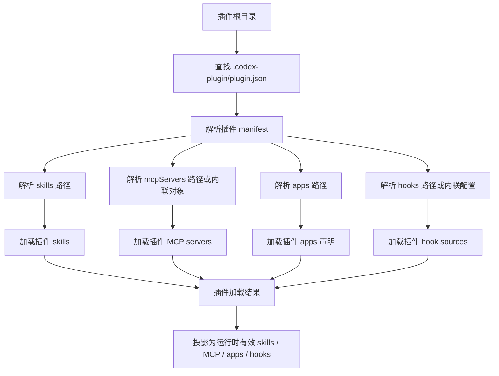
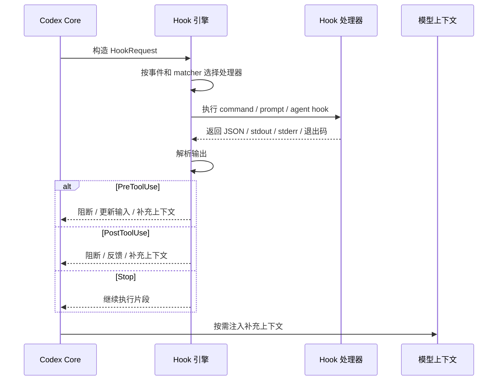
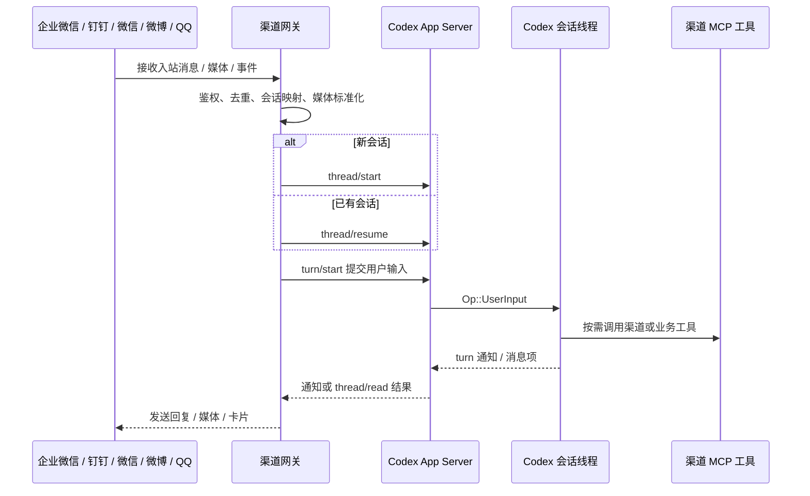

# Codex 扩展体系模块调研与 OpenClaw 迁移评估

本文按“模块定位、源码范围、核心职责、核心流程、关键实现、对外接口、可观测性、二开兼容性、风险”的模板整理。范围聚焦后续迁移 OpenClaw/AstronClaw 平台能力时最相关的 Codex 模块：

- Plugin
- Hooks
- MCP
- Skills
- App Server thread/turn API

结论均基于当前仓库源码路径，不按概念猜测。

## 1. 模块定位

这个模块在 Codex 体系里负责“扩展能力的声明、加载、注入、执行入口和外部会话接入”。

它不是一个单独 crate，而是一组协作模块：

- Plugin：把 skills、MCP servers、apps/connectors、hooks 和 UI metadata 打包。
- Hooks：在会话、工具调用、压缩、用户 prompt、子 agent、停止等生命周期点执行扩展逻辑。
- MCP：把外部工具进程/HTTP server 暴露为模型可调用工具。
- Native tools：通过 Rust extension `ToolContributor` 直接贡献工具。
- Dynamic tools：由 app-server client 为 thread 提供会话级工具。
- Skills：把指令型能力加载进 Codex 上下文，让模型知道如何使用工具或执行流程。
- App Server：给外部 UI、channel gateway、远程控制方提供 thread/turn/realtime API。

对 OpenClaw/AstronClaw 迁移而言，它对应的是：

```text
OpenClaw plugin + hook + channel + tool + skill
  -> Codex plugin + hooks + MCP + skills + app-server gateway
```

## 2. 源码范围

### 相关目录

| 目录 | 作用 |
| --- | --- |
| `codex-rs/plugin/src/` | 共享 plugin 模型、manifest 类型、plugin id、load outcome。 |
| `codex-rs/core-plugins/src/` | 本地/远程 plugin 加载、manifest 解析、skills/MCP/apps/hooks 装载、marketplace 和 manager。 |
| `codex-rs/hooks/src/` | Hook engine、事件输入输出、handler discovery、hook 声明和运行。 |
| `codex-rs/config/src/` | hooks、MCP、skills、apps 等配置 TOML/JSON 结构。 |
| `codex-rs/codex-mcp/src/` | MCP server 配置、连接、工具调用、apps MCP 兼容层。 |
| `codex-rs/ext/mcp/src/` | app-server 启动时注册 MCP contributor，包括 hosted plugin runtime 和 executor plugin MCP。 |
| `codex-rs/ext/skills/src/` | skills extension、provider、selection、render、tools。 |
| `codex-rs/app-server-protocol/src/protocol/` | app-server JSON-RPC 协议，包含 thread/turn/realtime/hook/apps/skills 方法。 |
| `codex-rs/app-server/src/request_processors/` | app-server 具体请求处理器。 |

### 关键文件

| 文件 | 具体原因 |
| --- | --- |
| `codex-rs/core-plugins/src/manifest.rs` | 解析 `.codex-plugin/plugin.json`，确认支持 `skills`、`mcpServers`、`apps`、`hooks`、`interface`。 |
| `codex-rs/core-plugins/src/loader.rs` | 真实加载 plugin skills、MCP servers、apps、hook sources。 |
| `codex-rs/plugin/src/lib.rs` | 定义 `PluginCapabilitySummary`、`PluginHookSource`、`AppDeclaration` 等共享模型。 |
| `codex-rs/plugin/src/load_outcome.rs` | 定义 `effective_mcp_servers`、`effective_apps`、`effective_plugin_hook_sources`，说明插件加载结果如何投影成运行时能力。 |
| `codex-rs/config/src/hook_config.rs` | 定义 hook 事件和 handler 类型。 |
| `codex-rs/hooks/src/events/pre_tool_use.rs` | `PreToolUse` 输入输出结构，支撑工具调用前策略、block、update input、补上下文。 |
| `codex-rs/hooks/src/events/post_tool_use.rs` | `PostToolUse` 输入输出结构，支撑工具调用后 trace、artifact、反馈。 |
| `codex-rs/hooks/src/engine/mod.rs` | hook engine 的 preview/run 入口。 |
| `codex-rs/hooks/src/declarations.rs` | plugin hook declaration 生成，说明插件内 hooks 会被 Codex 识别。 |
| `codex-rs/config/src/mcp_types.rs` | MCP server 配置结构。 |
| `codex-rs/core/src/mcp.rs` | Codex runtime MCP catalog 组合点。 |
| `codex-rs/ext/mcp/src/lib.rs` | hosted plugin runtime MCP contributor 和 executor plugin MCP contributor 安装点。 |
| `codex-rs/app-server-protocol/src/protocol/common.rs` | app-server JSON-RPC 方法清单，包含 `thread/start`、`turn/start`、`thread/realtime/*`。 |
| `codex-rs/app-server-protocol/src/protocol/v2/thread.rs` | thread API 参数和 `thread/inject_items` 结构。 |
| `codex-rs/app-server-protocol/src/protocol/v2/turn.rs` | turn API、`TurnStartParams`、`TurnSteerParams`、`UserInput`。 |
| `codex-rs/app-server-protocol/src/protocol/v2/realtime.rs` | realtime thread API 参数。 |
| `codex-rs/app-server/src/request_processors/turn_processor.rs` | `turn/start`、`turn/steer`、`thread/inject_items`、realtime append 的处理逻辑。 |
| `codex-rs/app-server/src/request_processors/thread_processor.rs` | `thread/start`、`thread/resume`、`thread/read` 等处理逻辑。 |

### 入口文件

| 入口 | 相关目录 | 说明 |
| --- | --- | --- |
| `.codex-plugin/plugin.json` | plugin 根目录 | 插件声明入口。 |
| `.mcp.json` 或 `mcpServers` 内联对象 | plugin 根目录或配置文件 | 工具接入入口。 |
| `hooks/hooks.json` 或 plugin manifest 内联 hooks | plugin 根目录 | 生命周期挂载入口。 |
| `skills/**/SKILL.md` | plugin/user/repo skills 目录 | 指令型能力入口。 |
| app-server JSON-RPC | `codex-rs/app-server-protocol` | channel gateway 和外部 UI 的会话入口。 |

## 3. 核心职责

### 负责

- 加载插件声明，把 `skills`、`mcpServers`、`apps`、`hooks` 转成 Codex 运行时可用能力。
- 在工具调用前后、会话开始/结束、用户 prompt、compact、subagent 生命周期点执行 hooks。
- 通过 MCP、native extension tools 或 dynamic tools 把能力暴露给模型调用。
- 通过 skills 把能力说明和操作规约注入模型上下文。
- 通过 app-server thread/turn API 让外部 channel gateway 创建会话、提交用户输入、读取结果。
- 对插件、hooks、MCP、apps 做 auth/feature/config 层面的投影和裁剪。

### 不负责

- 不执行 OpenClaw JS plugin SDK，例如不能直接运行 `api.registerTool(...)` 或 `registerToolHooks(api)`；工具要翻译为 MCP、native ToolContributor 或 dynamic tools。
- 不内置微信、微博、企业微信、钉钉、QQ Bot 等 channel runtime。
- 不负责外部 channel 的账号登录、消息去重、媒体下载、回执、重试、会话映射。
- 不保证所有 plugin/app connector 在 API key auth 下可用，apps route 有 auth gating。
- 不应该承载业务计费、租户鉴权、云端 relay 的强制逻辑；这些应在 app-server/native platform 或外部 gateway/service 层。

## 4. 核心流程

### 4.1 Plugin 加载流程



源码依据：

- `codex-rs/core-plugins/src/manifest.rs`
- `codex-rs/core-plugins/src/loader.rs`
- `codex-rs/plugin/src/load_outcome.rs`

### 4.2 Hook 执行流程



源码依据：

- `codex-rs/config/src/hook_config.rs`
- `codex-rs/hooks/src/engine/mod.rs`
- `codex-rs/hooks/src/events/pre_tool_use.rs`
- `codex-rs/hooks/src/events/post_tool_use.rs`
- `codex-rs/hooks/src/events/stop.rs`

### 4.3 Channel Gateway 通过 App Server 接入流程



源码依据：

- `codex-rs/app-server-protocol/src/protocol/common.rs`
- `codex-rs/app-server-protocol/src/protocol/v2/thread.rs`
- `codex-rs/app-server-protocol/src/protocol/v2/turn.rs`
- `codex-rs/app-server/src/request_processors/turn_processor.rs`
- `codex-rs/app-server/src/request_processors/thread_processor.rs`

## 5. 关键实现

### 5.1 核心实现

#### Plugin manifest 解析

`codex-rs/core-plugins/src/manifest.rs` 的 `RawPluginManifest` 明确支持：

- `name`
- `version`
- `description`
- `keywords`
- `skills`
- `mcpServers`
- `apps`
- `hooks`
- `interface`

`resolve_manifest_hooks` 支持 hook 以路径、路径数组、内联对象、内联对象数组存在。`resolve_manifest_mcp_servers` 支持 MCP 以路径或内联对象存在。

源码结论：普通 Codex plugin manifest 当前没有直接 `tools` 字段。`codex-rs/plugin/src/manifest.rs` 的 `PluginManifestPaths` 只有 `skills`、`mcp_servers`、`apps`、`hooks`；`codex-rs/plugin/src/load_outcome.rs` 也没有 `effective_tools`。这只限制 manifest 打包层，不限制 Codex runtime 通过 native `ToolContributor` 或 app-server `dynamic_tools` 暴露非 MCP 工具。

迁移意义：

- OpenClaw plugin 的 `skills` 可以迁到 Codex plugin `skills`。
- OpenClaw 外部业务工具可迁成 MCP server，再由 `mcpServers` 声明；平台深度工具可迁成 native `ToolContributor`；宿主/会话级工具可迁成 app-server `dynamic_tools`。
- OpenClaw `registerToolHooks` 应迁成 Codex `hooks`。
- OpenClaw channel metadata 可部分迁成 `apps`，但 channel runtime 仍要放外部 gateway。

#### Plugin 运行时投影

`codex-rs/plugin/src/load_outcome.rs` 的 `PluginLoadOutcome` 提供：

- `effective_mcp_servers`
- `effective_apps`
- `effective_plugin_hook_sources`

这说明 plugin 加载结果会被投影成真实运行时能力，而不是只用于展示。

#### Hook 配置和事件

`codex-rs/config/src/hook_config.rs` 的 `HookEventsToml` 支持 10 类事件：

- `PreToolUse`
- `PermissionRequest`
- `PostToolUse`
- `PreCompact`
- `PostCompact`
- `SessionStart`
- `UserPromptSubmit`
- `SubagentStart`
- `SubagentStop`
- `Stop`

`HookHandlerConfig` 只有：

- `command`
- `prompt`
- `agent`

迁移意义：

- OpenClaw 的 JS hook API 要重写为 command/prompt/agent hook。
- 平台级 trace、artifact、learning loop 可以挂 `PostToolUse` 和 `Stop`。
- 工具调用前安全策略可以挂 `PreToolUse` 和 `PermissionRequest`。

#### App Server thread/turn

`codex-rs/app-server-protocol/src/protocol/common.rs` 暴露：

- `thread/start`
- `thread/resume`
- `thread/read`
- `thread/turns/list`
- `thread/inject_items`
- `turn/start`
- `turn/steer`
- `turn/interrupt`
- `thread/realtime/start`
- `thread/realtime/appendText`
- `thread/realtime/appendAudio`
- `thread/realtime/appendSpeech`

`codex-rs/app-server/src/request_processors/turn_processor.rs` 的 `turn_start_inner` 把 `TurnStartParams.input` 转为 core input，并提交 `Op::UserInput`，这是外部 channel 触发 Codex 推理的关键。

`thread/inject_items` 只追加 raw Responses API items，不启动 turn，适合导入历史，不适合实时 channel inbound。

### 5.2 关键模块

| 模块 | 核心实现 | 迁移价值 |
| --- | --- | --- |
| Plugin Manifest | `core-plugins/src/manifest.rs` | 决定 OpenClaw plugin manifest 如何翻译。 |
| Plugin Loader | `core-plugins/src/loader.rs` | 决定 plugin 的 skills/MCP/apps/hooks 是否进入运行时。 |
| Hook Engine | `hooks/src/engine/mod.rs` | 决定平台 hook 如何执行、如何返回上下文/阻断/反馈。 |
| Hook Events | `hooks/src/events/*` | 决定各生命周期点能拿到哪些数据。 |
| MCP Extension | `ext/mcp/src/lib.rs` | 决定 hosted plugin runtime 和 executor plugin MCP 如何接入。 |
| App Server Protocol | `app-server-protocol/src/protocol/*` | 决定 channel gateway 可以用哪些外部 API。 |
| Turn Processor | `app-server/src/request_processors/turn_processor.rs` | 决定外部输入如何变成 Codex 推理。 |

## 6. 对外接口

### 上游调用方

- Codex TUI / app clients：通过 app-server JSON-RPC 调 `thread/*`、`turn/*`、`skills/*`、`hooks/*`、`apps/*`。
- Plugin manager：读取 `.codex-plugin/plugin.json` 并加载能力。
- Core tool runtime：调用 hooks 和 MCP tools。
- 外部 channel gateway：建议通过 app-server JSON-RPC 接入。

### 下游依赖

- MCP server 进程或 HTTP 服务。
- Hook command/prompt/agent handler。
- Skills 文件系统或 orchestrator/provider。
- App connector backend / hosted plugin runtime。
- Thread store、rollout history、Codex core thread。

### 主要接口

| 接口 | 用途 | 源码依据 |
| --- | --- | --- |
| `.codex-plugin/plugin.json` | 插件声明入口 | `core-plugins/src/manifest.rs` |
| `mcpServers` | 注册 MCP server | `core-plugins/src/manifest.rs`, `core-plugins/src/loader.rs` |
| `hooks` | 注册 plugin hooks | `core-plugins/src/manifest.rs`, `hooks/src/declarations.rs` |
| `skills` | 注册 plugin skills | `core-plugins/src/loader.rs` |
| `thread/start` | 创建线程 | `app-server-protocol/src/protocol/common.rs`, `v2/thread.rs` |
| `thread/resume` | 恢复线程 | `app-server-protocol/src/protocol/common.rs`, `v2/thread.rs` |
| `turn/start` | 提交用户输入并启动推理 | `app-server-protocol/src/protocol/v2/turn.rs`, `app-server/src/request_processors/turn_processor.rs` |
| `turn/steer` | 向活跃 turn 追加输入 | `app-server-protocol/src/protocol/v2/turn.rs`, `turn_processor.rs` |
| `thread/read` | 读取线程状态/历史 | `app-server-protocol/src/protocol/common.rs`, `v2/thread.rs` |
| `thread/inject_items` | 追加 raw Responses API items | `app-server-protocol/src/protocol/v2/thread.rs`, `turn_processor.rs` |
| `thread/realtime/*` | 实时文本/音频输入 | `app-server-protocol/src/protocol/v2/realtime.rs`, `turn_processor.rs` |

## 7. 可观测性

### 当前已做的观测

- Hook run 有事件和 summary：`codex-rs/hooks/src/engine/mod.rs`、`codex-rs/hooks/src/events/*` 使用 `HookRunSummary`、`HookCompletedEvent`、`HookRunStatus`。
- Hook 输出会被 spill，避免过大内容直接塞上下文：`codex-rs/hooks/src/output_spill.rs`。
- Plugin 有 capability summary 和 telemetry metadata：`codex-rs/plugin/src/lib.rs` 的 `PluginCapabilitySummary`、`PluginTelemetryMetadata`。
- App-server turn/thread 有通知事件：`codex-rs/app-server-protocol/src/protocol/common.rs` 中 `turn/started`、`turn/completed`、`turn/diff/updated`、`thread/started` 等 server notifications。
- Turn API 支持 `responsesapi_client_metadata`，可把 channel/message metadata 写入 Responses API turn metadata：`codex-rs/app-server-protocol/src/protocol/v2/turn.rs`。

### 未来可补齐

- Channel gateway 统一埋点接口：入站消息、去重结果、thread mapping、turn id、外部 message id、发送回执。
- MCP tool 级埋点：server name、tool name、latency、approval、error code、payload size。
- Hook 级埋点：event name、handler id、耗时、exit status、block reason、output size。
- Plugin 级埋点：plugin id、version、active state、enabled capabilities、加载失败原因。
- Skills 级埋点：skill 命中、读取、注入、禁用、来源。
- 可观测性模块应只提供埋点接口和统一 schema，不承载业务判断；具体在哪些业务节点埋点由 channel/MCP/hook/native extension 自己决定。

## 8. 二开模块兼容性

### 8.1 AstronClaw 模块迁移

#### Channel

微博、微信、飞书、钉钉、企业微信、QQ Bot 等生态渠道不建议迁成 Codex hook。

推荐方案：

- 外部 channel gateway 负责账号、鉴权、消息接收、媒体下载、去重、重试、回执。
- gateway 调 app-server：
  - `thread/start` 或 `thread/resume`
  - `turn/start`
  - `thread/read` 或订阅 notifications
- channel 的发送消息、上传媒体、查联系人、查群、建卡片等动作作为 MCP tools 提供给模型。
- plugin 只打包 `skills`、`mcpServers`、`hooks`、可选 `apps`。

可行性：高。

限制：

- 需要实现 gateway，不是只改 plugin manifest。
- app-server JSON-RPC 鉴权、部署拓扑、会话映射需要自研。
- realtime API 当前是 experimental，语音/实时场景先不要作为唯一方案。

#### 工具

OpenClaw 当前 `api.registerTool` 类工具有三种迁移路径：

- 外部业务工具：迁到 MCP。
- 平台深度工具：迁到 native `ToolContributor`。
- 宿主/会话级工具：迁到 app-server `dynamic_tools`。

适合优先按 MCP 迁移的工具：

- `team_plan`
- `team_provision`
- `team_execute`
- `team_complete`
- `team_update_progress`
- `team_cleanup`
- `artifact_capture`
- `base-web-search`
- `astronclaw_todo_create`
- `astronclaw_todo_update`
- `astronclaw_todo_complete`
- `astronclaw_todo_get`
- `team_create_task`
- `team_update_todo`
- `team_finish_task`
- `qqbot_channel_api`
- `qqbot_remind`

可行性：高。

限制：

- MCP/native/dynamic tool 都需要重写工具 schema 和实现。
- 高风险工具应配置 approval policy。
- `artifact_capture` 更适合 hook，不一定要暴露给模型。

#### 端云协同

OpenClaw 的 agent relay、gateway、deduct、AstronMem、trace 等平台能力可以分层迁移：

- 外部云服务/gateway：承接设备、账号、租户、会话路由。
- Codex app-server：承接 thread/turn、配置、runtime extension。
- Codex plugin：声明 skill/MCP/hook。
- Native extension：只有在需要改 memory backend、auth、MCP catalog、multi-agent 调度时才使用。

可行性：中。

依赖项：

- 自有 auth/token。
- 自有 channel gateway。
- 自有 plugin registry/marketplace 策略。
- thread/session mapping DB。
- telemetry/trace pipeline。

#### Team

OpenClaw team 模式有两种迁移路线：

- 轻量：把 team 工具做成 MCP 或 dynamic tools，skill 说明如何调用。
- 深度：接 Codex multi-agent/job/native extension。

可行性：中。

依赖项：

- 如果只是任务/todo，MCP 或 dynamic tools 足够。
- 如果要控制 Codex 子 agent 生命周期，需要研究 `codex-rs/core/src/tools/handlers/multi_agents_v2` 和 `agent_jobs`，不能只靠 plugin。

#### Skills

Skills 迁移最直接：

- 复制 `SKILL.md` 和引用的 `references/`、`scripts/`、`assets/`。
- 替换 OpenClaw 专有命令、路径、message tool 名称。
- 需要工具的 skill 先配 MCP、native tool 或 dynamic tool。
- 和 channel 相关的 skill 应改写为 gateway/MCP 使用说明。

可行性：高。

限制：

- 不要把 secret 写进 skill。
- 强依赖 OpenClaw session/artifact 日志格式的 skill 要重写解析器。

### 8.2 如何二开

横向扩展推荐顺序：

1. 新业务 API：优先评估 MCP、native ToolContributor、dynamic tools 三选一。
2. 需要深度接入 Codex runtime 的平台工具：写 native ToolContributor。
3. 宿主或会话级工具：用 dynamic tools。
4. 新工作流说明：写 skill。
5. 工具调用前后策略、trace、artifact：写 hook。
6. 新 channel：写外部 gateway，经 app-server `thread/start` + `turn/start` 接入。
7. 需要出现在 app/connector 管理面：plugin 里声明 `apps`。
8. 需要改 Codex 内部机制：再做 native extension 或 fork core/app-server。

推荐 plugin 结构：

```text
astron-channel-plugin/
  .codex-plugin/
    plugin.json
  .mcp.json
  hooks/
    hooks.json
    trace.sh
  skills/
    astron-channel/
      SKILL.md
  server/
    src/
      index.ts
```

`plugin.json`：

```json
{
  "name": "astron-channel-plugin",
  "version": "0.1.0",
  "skills": "./skills",
  "mcpServers": "./.mcp.json",
  "hooks": "./hooks/hooks.json"
}
```

### 8.3 改造难度评估

| 模块 | 难度 | 原因 |
| --- | --- | --- |
| Skills 迁移 | 低 | 格式接近，主要是改说明和依赖路径。 |
| Tool -> MCP | 中 | 需要重写 MCP schema、server 实现、权限策略。 |
| Tool -> Native ToolContributor | 中高 | 需要 Rust extension、app-server 注册、测试和发布。 |
| Tool -> Dynamic tools | 中 | 需要 app-server client 处理 DynamicToolCall，适合宿主级工具。 |
| Hook 迁移 | 中 | OpenClaw JS hook API 不能直接用，要改 command/prompt/agent handler。 |
| Artifact/Trace | 中 | Hook 可承接，但要设计输出大小、异步上报、失败重试。 |
| Channel gateway | 中高 | app-server API 可用，但账号、媒体、重试、会话映射都在外部 gateway。 |
| Team/multi-agent 深度迁移 | 高 | 涉及 Codex multi-agent/job 生命周期，不是普通 plugin 能完全覆盖。 |
| AstronMem 原生记忆 | 高 | 如果要成为 Codex 原生 memory recall，需要改 `ext/memories`。 |
| 云端 relay/gateway/deduct | 高 | 涉及 auth、租户、计费、session router、平台可靠性。 |

## 9. 风险

| 风险 | 影响 | 缓解 |
| --- | --- | --- |
| 把 OpenClaw JS plugin SDK 当成 Codex plugin runtime | 插件无法运行或行为不完整 | 明确翻译为 MCP/hooks/skills/app-server gateway。 |
| 用 hook 做 channel inbound | 无法创建可靠外部消息入口 | channel 必须通过 app-server thread/turn API。 |
| 误用 `thread/inject_items` 作为用户消息入口 | 只写历史，不触发推理 | 实时用户消息用 `turn/start`。 |
| 直接把 channel secret 写进 skill/plugin manifest | 安全泄漏 | secret 放 gateway/MCP env 或 secret manager。 |
| 业务计费放在模型工具里 | 可绕过，审计困难 | 计费在 gateway/app-server/service 强制执行。 |
| MCP tool 权限过宽 | 模型误调用高风险操作 | 配置 approval、白名单工具、参数校验。 |
| Hook 输出过大 | 污染上下文或影响性能 | 使用输出截断/文件 spill，限制 payload。 |
| Channel gateway 未做幂等 | 重复回复、重复执行工具 | 外部 message id + thread id + turn id 去重。 |
| realtime API 依赖过早 | 实验 API 变化导致 channel 不稳定 | 先用 `turn/start`，realtime 单独灰度。 |
| Deep team 只用 MCP/dynamic tools 硬撑 | 无法管理子 agent 生命周期 | 需要时做 native extension。 |
| 云端 OpenClaw 组件照搬 | 和 Codex auth/backend/connector 模型冲突 | 设计自有 app-server/gateway/extension 边界。 |

总体建议：

- 第一阶段不要改 Codex core，先用 plugin + MCP + hooks + skills + app-server gateway 跑通。
- 第二阶段把 channel gateway、trace、artifact、team、memory 各自拆成可观测、可回滚的模块。
- 第三阶段只有在确定需要改 Codex 原生生命周期时，再进入 native extension 或 fork core/app-server。
